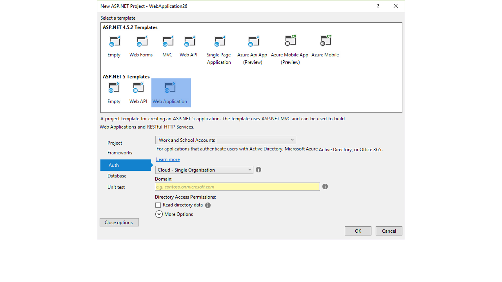

This repo contains old designs/iterations of ASP.NET Visual Studio features. None of these ideas are going to be implemented, they were just some ideas that we were playing around with. You can find click throughs in the .pdf files in this repo. 

You can see some screenshots below as well. They are in no particular order.

